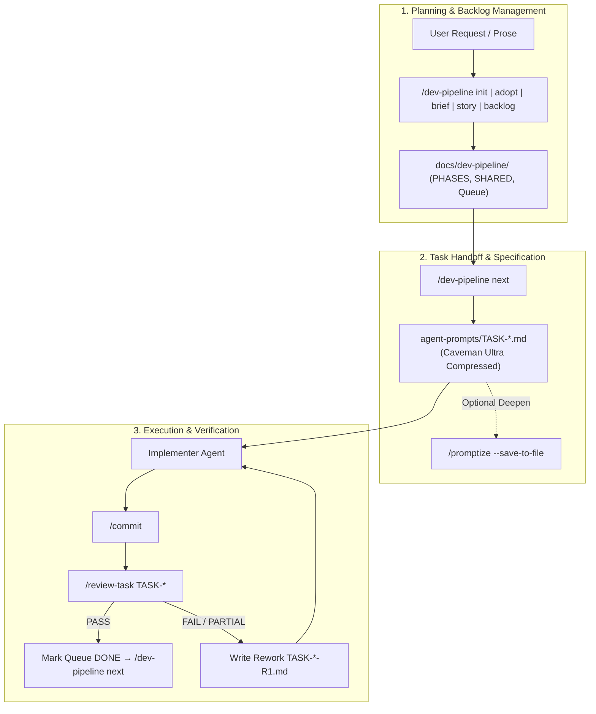

# 🚀 AI Development Pipeline & Skill Suite

[](https://github.com/good-skills/dev-pipeline)
[](https://skills.sh)
[](LICENSE)
[](#-token-budget--caveman-optimization)

> **Enterprise-Grade AI Agent Orchestration & Tracking Suite**  
> Maintain business-logic integrity, contract alignment, user-story traceability, and token efficiency across multi-agent AI development sessions.

---

## ⚡ Quick Installation

Install globally or into your workspace using the standard `skills` CLI:

```bash
# Install ALL 8 skills globally
npx skills add good-skills/dev-pipeline -g --all

# Or install all skills in current workspace
npx skills add good-skills/dev-pipeline --all

# Or install specific skills (e.g., dev-pipeline and promptize)
npx skills add good-skills/dev-pipeline -s dev-pipeline promptize
```

---

## 🛠️ The 8 Skills in this Suite

| Skill | Trigger / Command | Description | Version |
| :--- | :--- | :--- | :--- |
| 🗂️ **`dev-pipeline`** | `/dev-pipeline …` | Phase-based product development tracking, backlog management, `US-*` story spine, queue & contract indexing (`SHARED.md`). | `v1.9.0` |
| ⚡ **`promptize`** | `/promptize …` | Transforms short user prompts into self-contained engineering specs before implementation (`--execute`, `--compress`). | `v2.3.0` |
| 🐛 **`bug-report`** | `/bug-report …` | Converts unstructured error notes and symptoms into evidence-classified bug reports (`--minimal`, `--full`). | `v1.1.0` |
| 🧹 **`clear-antipatterns`** | `/clear-antipatterns …` | Conservative, type-safe fixes for TypeScript anti-patterns and unsafe assertions. | `v1.0.0` |
| 🧭 **`codebase-onboarding`** | `/codebase-onboarding …` | Fast, token-efficient repository onboarding guide generator. | `v1.0.0` |
| 🗺️ **`full-codebase-onboarding`** | `/full-codebase-onboarding …` | Deep visual guidebook generation with AST chunking, Mermaid diagrams, and LiteLLM tutor integration. | `v1.0.0` |
| 📝 **`commit`** | `/commit` | Task-scoped Conventional Commit generator with strict diff boundaries. | `v1.2.0` |
| 🔍 **`review-task`** | `/review-task …` | Automated PASS / FAIL / PARTIAL task verification against Task Prompt AC with rework queue management. | `v1.1.0` |

---

## 🔄 Multi-Agent Lifecycle Diagram



---

## 📖 Help System (`--help` Output for Each Skill)

Every skill in this suite features built-in `--help` / `-h` support. Call any command with `--help` to inspect its usage, flags, and token budget rules:

```bash
/dev-pipeline --help
/promptize --help
/bug-report --help
/commit --help
/review-task --help
/codebase-onboarding --help
/full-codebase-onboarding --help
/clear-antipatterns --help
```

---

### 1. 🗂️ Dev Pipeline (`/dev-pipeline`)

```text
Usage: /dev-pipeline <subcommand> [flags]

Subcommands:
  init [name]             Bootstrap layout & product identity docs
  adopt                   Attach pipeline to existing project docs (adopt.md)
  brief [PH-ID] <prose>   Ingest phase capability descriptions with claim dedup
  story <prose>           Create/refine product-wide user stories (US-*) in SHARED
  story extract           Harvest US-* stories from implemented/shipped features
  backlog / plan          Inspect product and update epic/feature backlog
  phase new <slug>        Create new phase & optionally set active
  phase switch <PH-ID>    Switch active phase without breaking IDs
  phase status            Show active phase and epic/feature counts
  shared / refresh        Show or rebuild shared contract index (SHARED.md)
  surface new <slug>      Register a new product surface/service
  next / task [FEAT-ID]   Emit next ready task prompt under agent-prompts/
  status                  Compact pipeline status overview

Flags:
  --set-active            Set newly created phase/surface as active
  --compress / --caveman  Apply Caveman prose compression pass on task prompt
  --promptize             Deepen next handoff prompt using Promptize skill
  --help, -h              Display this help message
```

---

### 2. ⚡ Promptize (`/promptize`)

```text
Usage: /promptize [flags] <short request>

Options:
  --execute               Build prompt and immediately implement (runs risk checks)
  --minimal               Force minimal 4-section engineering spec (≤500 tokens)
  --full                  Force detailed 20-section engineering spec (≤3000 tokens)
  --compress, --caveman   Force Caveman prose compression pass on rendered spec
  --save-to-file [path]   Save prompt body to file under docs/promptize-prompts/
  --save                  Alias for --save-to-file
  --help, -h              Display this help message

Caches & Gates:
  Reuse lookup (SESSION-CACHE.md) → Ultra-gate → Micro direct-render → Fast path → Delta inspect
```

---

### 3. 🐛 Bug Report (`/bug-report`)

```text
Usage: /bug-report [flags] <unstructured problem text / error notes>

Options:
  --minimal               Generate 4-section concise bug report
  --full                  Generate detailed report (preconditions, regression, scope)
  --save [path]           Save bug report artifact under bug-reports/
  --help, -h              Display this help message

Evidence Classification:
  Reported (user claim) | Observed (verified log/file) | Inferred (labeled) | Unknown
```

---

### 4. 📝 Commit (`/commit`)

```text
Usage: /commit [hint]

Options:
  --help, -h              Display git safety rules and inspection hierarchy

Inspection Hierarchy (Token Savings):
  git status -sb → Session reuse → git diff --stat → Scoped git diff -- <paths>
```

---

### 5. 🔍 Review Task (`/review-task`)

```text
Usage: /review-task [TASK-ID] [flags]

Options:
  --pull                  Pull current branch (ff-only) before reviewing
  --no-pull               Skip git pull (default)
  --help, -h              Display help message, workflow, and verdict rubrics

Verdicts:
  PASS     → Update queue row to DONE → prompt user to run /dev-pipeline next
  FAIL     → Write rework prompt agent-prompts/TASK-*-R1.md
  PARTIAL  → Write rework prompt for remaining open acceptance criteria
```

---

## 🧠 Token Budget & Caveman Optimization

This suite incorporates the **Selective Caveman Policy** (`shared/caveman-token-policy.md`) and **Token Budget System**:

1. **Artifact Boundary Policy:**
   - **Agent Handoff Prompts (`agent-prompts/TASK-*.md`):** Compressed using Caveman Ultra prose pass (50–70% token savings for implementer agents).
   - **Human-Facing Product Docs (`PRODUCT.md`, `PHASES.md`, `US-*.md`):** Preserved in natural, professional engineering prose.
2. **Subagent Delegation:**
   - Code inspection during `adopt` or `story extract` delegates to `cavecrew-investigator` subagents, returning compact `path:line` evidence without flooding the main conversation context.
3. **Immutable Technical Spans:**
   - Identifiers (`TASK-*`, `US-*`), code blocks, file paths, CLI commands, `MUST` statements, and Acceptance Criteria remain **100% verbatim**.

---

## 📄 License

MIT License © 2026 Good Skills Team.
